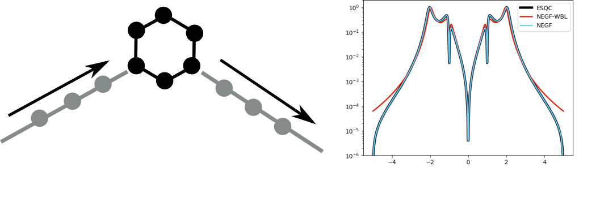
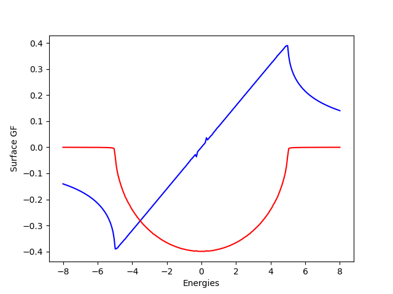
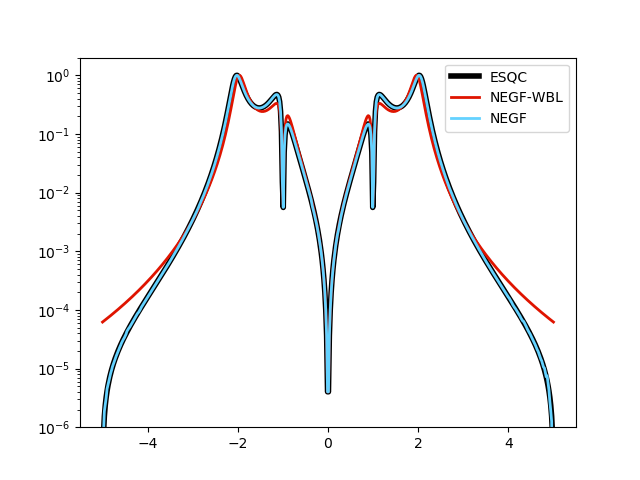
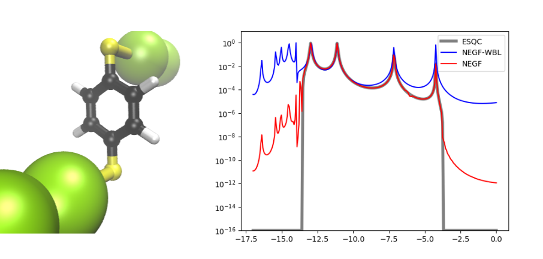

# Huskyton

## Installation

Clone the repository and cd into it. Then use pip to install the module

```
pip install ./
```

The installation will compile the huckel dynamic library. For that you must have gcc installed. 


## Example: Tight-binding model of a benzene ring

Once the installation is done you can use the module as in the following example. In this example we compute the transmission of a 'benzene' molecule using simple electrodes containing only one states per unit cell. 

Husky allows to compute the electronic transmission of this system (and any other systems defined similarly) using different theoretical framework. For example the ESQC and NEGF transmission calculated with Husky of the system above is represented below.




### Defining the junction geometry

Before doing any simulation on the transport we need to define the junction geomerty. We need to import the ```Junction``` class defined in ```husky.hamiltonian.ElectronicSystem```. Some basic definition of tight-binding hamiltonian are defined in ```husky.hamiltonian.model``` as for example cyclic armoatic molecules. We can add the hamiltonian of the central part with the ```add_central_matrix(h0)```

```python
import numpy as np
from husky.hamiltonian.ElectronicSystem import Junction
from husky.hamiltonian.model import tight_binding as tb

# define the junction
system = Junction()

# add the molecule hamiltonian
# here a cyclic aromatic with 6 centers, 
# onsite energy e =  0 eV 
# coupling      a = -1 eV
system.add_central_matrix(h0=tb.cyclic_aromatic(N=6,e=0,a=-1.))
```

We now define the electrodes. Here the electrodes contains only one state per unit cell. We can add as many electrodes as we want via the ```add_elecrode_matrix(h0,hi,vmol)```. Here ```h0``` is the hamiltonian of each unit cell, ```hi``` the interation between neighboring unit cells and ```vmol``` the interaction matrix between the last site of the electrode and the central part of the junction.

```python
# add single state electrodes
# onsite energy e0 = 0
# coupling between unit cell of the electrodes vi = -2.5
# coupling between the last site of the electorde and the molecule vmol 1
e0,vi,vmol = 0.,-2.5, 1.

# first electrode
system.add_electrode_matrix(h0 = np.array([e0]), hi = np.array([vi]),vmol = np.array([vmol,0,0,0,0,0]))

# second electrode
system.add_electrode_matrix(h0 = np.array([e0]), hi = np.array([vi]),vmol = np.array([0,0,vmol,0,0,0]))
```

### Computing the transmission with ESQC

ESQC or Ellastic Scattering Quantum Chemistry is a powerfull method to compute the electronic transmission of molecular junction. We have used here the formalism defined in the references 

  * [1] Electronic transport calculations for self-assembled monolayers of 1,4-phenylene diisocyanide on Au111 contacts. Robert Dahlke and Ulrich Schollwock Phys Rev B 69 085324 2004

  * [2] Numerical calculations for electronic transport through molecular systems Robert Dahlke. PHD THESIS 2004

This method is implemented in the ```ESQCsolver``` defined in ```husky.transport.esqc```. To define an instance of the solver we must pass a Junction instance as defined above. The calculation of the transmission is then simply achieved with the ```compute_transmission()``` method.

```python
##########################################################
#				ESQC
##########################################################
from husky.transport.esqc import ESQCsolver

# declare the esqc solver and the enrgy range
trans=ESQCsolver(system)
trans.set_energy_range(emin=-5,emax=5,nE=500)

# compute the transmission and plot it
te_esqc = trans.compute_transmission()
```


### Computing the transmission with NEGF

Non-equlibrium Green functions are a particularly efficient method for quantum transport. We have here implemented this method in a ```NEGFsolver``` defined in ```husky.transport.negf```. As for the ```ESQCsolver``` a ```Junction``` instance must be passed during the definition of a ```NEGFsolver``` instance. 


#### Wide band limit approximation

The wide-band-limit approximation is a very popular simplification of the transport problem where the density of state of the electrodes is assumed constant. To use the WBL approximation we must set it true in the solver instance and give a value of the local DOS of the electrode. Once this is done the calculation of the transport is simply done by the ```compute_transmission()``` method.

```python
##########################################################
#				NEGF - WBL
##########################################################
from husky.transport.negf import NEGFsolver
trans=NEGFsolver(system)
trans.set_energy_range(emin=-5,emax=5,nE=500)


# set the wbl approx on and define the ldos of the elctrodes
trans.set_wide_band_limit(True)
trans.set_local_dos_electrode(0.4)

# compute the transport properties
te_negf_wbl = trans.compute_transmission()
```

#### Beyond the WBL approximation

However once can also compute the DOS of the electrode via their surface green function to obtain a more accurate values of the transmission. The calculation of the SGF is done via a method of the ```Junction``` instance. The SGF is precomputed before the calculation of the transport for efficiency reasons. Once the SGF calculated, the transmission is computed as previously via the ```compute_transmission()``` method.

```python
##########################################################
#				NEGF - NO WBL
##########################################################
trans=NEGFsolver(system)
trans.set_energy_range(emin=-5,emax=5,nE=500)

# set the wbl approx OFF and define the 
# surface green function of the electrodes
trans.set_wide_band_limit(False)
trans.junction.precompute_electrodes_surface_green_function(np.linspace(-8,8,250),tol=1E-6,identical_electrodes=True)

# compute the surface green functions of the electrodes
te_negf = trans.compute_transmission()
```

The surface green function is plotted by default in the file sgf.png. As we can see below the we obtain here the typical variation of the real (blue) and imaginary (red) part of the sruface green function of these simple electrodes. We can also see why the WBL is sometimes justified. Here the real part of the SGF is null around E=0 and the imaginary part is relatively flat. 



### Plotting the results

Once everything is calculated we can plot the result to compare the different methods.

```python
##########################################################
#				Plot the results
##########################################################
import matplotlib.pyplot as plt 

plt.semilogy(trans.energies,te_esqc,linewidth=4,color='black',label='ESQC')
plt.semilogy(trans.energies,te_negf_wbl,linewidth=2,color='#DF1400',label='NEGF-WBL')
plt.semilogy(trans.energies,te_negf,linewidth=2,color='#64D2FF',label='NEGF')
plt.ylim([1E-6,2])
plt.legend()
plt.savefig('te.png')

```



As we can see below the ESQC results agree with NEGF calculation including the SGF of the elecrodes. However the WBL approximation leads to slightly different results as expeced. One can also clearly see the quantum interference around E=0 that are so typical of this system.


## Example: Extended Huckel model of a benzene ring

It is possible to use extended huckel formalism to compute the electronic structure of the molecules and electrodes. We here consider a simple benzene dithiol connected to monoatomic gold electrodes.



### Defining the system 

As for the TB case the first step consists in defining the junction structure. We are here going to import xyz file to define the different parts of the junction and compute its electronic structure using extended huckel theory. This is done via the embedded ```hkl.so``` dynamic library that should be automatically compiled durinf the installation. The xyz files can be found in the directory: ```husky/example/extended_huckel/bdt/```

```python
from husky.hamiltonian.ElectronicSystem import Junction
# create the junction 
system = Junction()

# add the xyz files of the molecule
system.add_molecule_xyz("./mol.xyz")

# add the xyz of the electrodes
system.add_electrode_xyz("elec1_1atom.xyz")
system.add_electrode_xyz("elec2_1atom.xyz")

# write a xyz just to make sure that everything went ok
system.write_xyz()

# add the exended Huckel parameters
system.add_huckel_parameters('./CHSAu.param')

# compute the hamiltonians/overlaps using extended huckel theory
system.compute_matrices_huckel(lowdin_ortho=False)

```

### Transmission with the different methods

Once the system is define we can use the different methods to compute the transmission coefficient. This is identical to the TB case as only the matrices defining the electronic structure of the junctions have changed.

```python

from husky.transport.negf import NEGFsolver
from husky.transport.esqc import ESQCsolver


import matplotlib.pyplot as plt 
import numpy as np

##########################################################
#				ESQC
##########################################################

trans = ESQCsolver(system)
trans.set_energy_range(emin=-17,emax=0,nE=250)

# compute the TE
trans.force = True
trans.debug = True
trans.eps_prop = 1E-6
te_esqc = trans.compute_transmission()


##########################################################
#				NEGF - WBL
##########################################################
trans=NEGFsolver(system)
trans.set_energy_range(emin=-17,emax=0,nE=250)


# set the wbl approx on and define the ldos of the elctrodes
trans.set_wide_band_limit(True)
trans.set_local_dos_electrode(0.5)

# compute the transport properties
te_negf_wbl = trans.compute_transmission()


##########################################################
#				NEGF - NO WBL
##########################################################
trans=NEGFsolver(system)
trans.set_energy_range(emin=-17,emax=0,nE=250)

# set the wbl approx OFF and define the 
# surface green function of the electrodes
trans.set_wide_band_limit(False)
trans.junction.precompute_electrodes_surface_green_function(np.linspace(-18,1,100),eps=1E-2,tol=1E-6,itermax=1E4,identical_electrodes=True)

# compute the surface green functions of the electrodes
te_negf = trans.compute_transmission()


##########################################################
#				Plot the results
##########################################################

#plt.plot(trans.energies,trans.junction.electrodes['0'].nprop_channel)

plt.semilogy(trans.energies,te_esqc+1e-16,color='grey',linewidth=4,label='ESQC')
plt.semilogy(trans.energies,te_negf_wbl+1e-16,color='blue',label='NEGF-WBL')
plt.semilogy(trans.energies,te_negf+1e-16,color='red',label='NEGF')
plt.ylim([1E-16,10])
plt.legend()
plt.savefig('te.png')


```